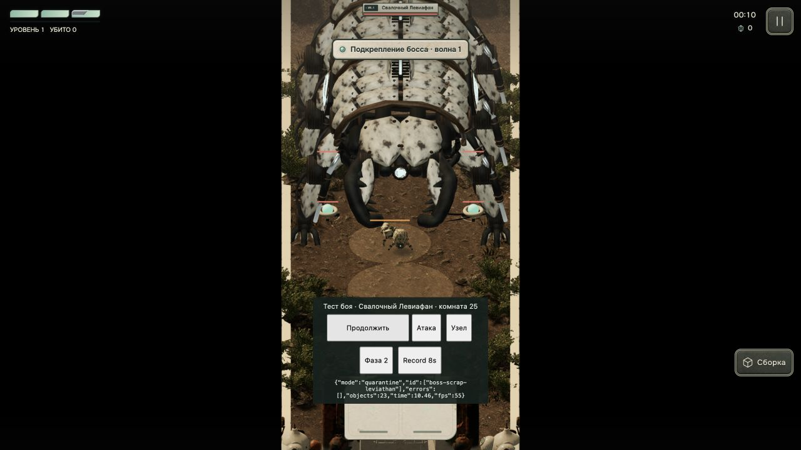

# Поворот корпуса боссов

Скорость поворота обратно пропорциональна размеру: `8 / (radius × frameScale × visualScale)` радиан в секунду. Для сборных боссов учитывается размер рамы. Скорость ходьбы и частота атак не меняются. Миссионные боссы сохраняют направление во время предупреждения и рывка; обычные враги используют прежнее поведение.

Проверка в Codex in-app browser, реальный маршрут `?review=mission-boss&mission=quarantine&sound=0&quality=medium&lang=ru&turn=180`. Параметр `turn=180` задаёт начальный разворот от игрока и задерживает атаки на 10 секунд; движение и поворот выполняет обычный контроллер игры.

- Левиафан, радиус 14: за 0,4333 секунды повернулся на 0,2476 радиана — 32,74°/с. Полный разворот завершился. Данные: `partial.json`, `runtime.json`.
- Ловчий, радиус 3,6: за 0,3 секунды повернулся на 0,666667 радиана — 127,32°/с. Данные: `hunter.json`.
- Оба замера совпадают с расчётными углами; модели загружены, ошибок ресурсов 0.
- 46 из 47 профильных тестов прошли, включая новые проверки угловой скорости, кратчайшего пути, независимости от FPS, заморозки, фиксации атак и отображения угла модели. Единственная ошибка — прежнее ожидание урона 2 в `boss-families.test.mjs:59`; до этой правки у Ловчего уже было `damage: .5`. Урон не изменялся.
- Vite собрал код успешно. Это проверка компиляции без копирования публичных ресурсов; полный экспорт ассетов не запускался.

