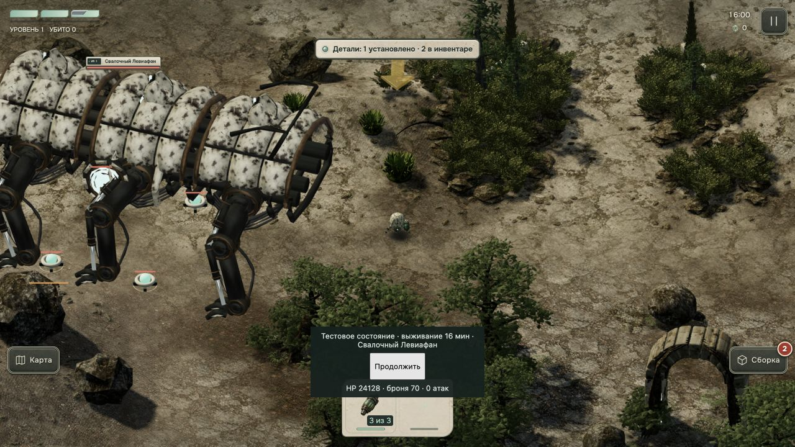

# Опора боссов и проход через преграды

- Боссы с радиусом от 6 метров идут напрямую через декорации и здания событий. Камни, деревья и строения не участвуют в их выборе пути. Границы поверхности, разрывы и ещё не загруженные участки остаются закрытыми.
- Лапы пяти готовых моделей учитывают высоту земли под своим пятном опоры. После анимации проверяется зазор видимой геометрии над поверхностью; при недостижимой цели лапы корпус приподнимается. Уязвимые опоры используют высоту земли в собственной позиции.
- Модели, материалы, скорости движения и ранее настроенные скорости поворота сохранены.

Проверено 48 профильными тестами: столкновения обычных врагов и игрока, прямое движение огромных боссов, края и разрывы карты, навигация, механики атак, повороты и все пять GLB на наклонной поверхности. В проверке рельефа перебраны реальные вершины моделей во время движения, поворота, удара и заморозки. Все тесты прошли (`tests.log`). Код собран Vite без копирования публичных ассетов (`build.log`); полный экспорт ресурсов не запускался.

Текущая проверка в Codex in-app browser: `?review=survival-boss&boss=2&sound=0&quality=medium&lang=ru`. Левиафан начал движение из позиции, заблокированной обычной проверкой препятствий, и за 0,2083 секунды прошёл 0,15570425 метра — согласно его скорости 0,7475 м/с. Высота центра совпадает с высотой земли. Состояния сохранены в `runtime.json`; видимые лапы проверены на `leviathan.png`.

