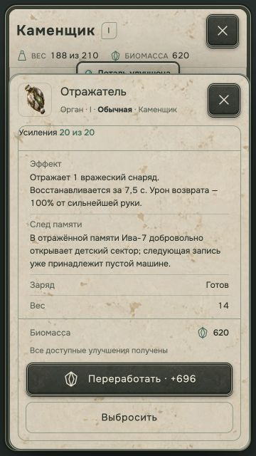
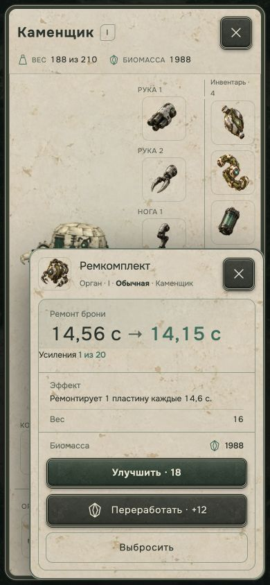

# Улучшения органов и перехват Отражателя — 14.09.2026

Реализованы согласованные 20/2 покупки, уклонение до 70% и отдельные заряды Отражателей. [Правила и формулы](../../balance/organ-upgrades.md).

## Проверено

- `final-focused-tests.tap`: 66/66 PASS, включая 23 новых проверки органов. Реальные `receiveHit`, `tickHealth`, `tickHostileShots` и `step`: цены, пределы, недоступная покупка, ранги I/V, Корнеходы, сохранение таймеров/экземпляра, приоритет защит, независимые заряды, видимая запасная цель, отсутствие рук, стены, перехват помощником, объекты миссии, первое попадание ответного снаряда и отсутствие повторного отражения.
- `build.log`: Vite production compilation PASS в отдельную `temp/organ-upgrades-build`. Для проверки кода отключено копирование public; это не экспорт игрового дистрибутива и не публикация. Предупреждение о размере основного JS-чанка сохранено.
- `combat-scenarios.json`: 15 детерминированных сценариев через настоящий `step`: 0/10/20 покупок, одиночный/двойной Отражатель, уклонение, смешанная защита и восстановление. Подготовленные сборки V ранга, замороженный враг, 3 входящих снаряда в секунду, до 60 секунд. Улучшения выданы для сравнения. Это проверка боевых сочетаний, не полный забег; итоговый баланс требует длительных игровых прогонов.
- Реальный интерфейс сборки через существующий маршрут `/?review=isaac&scenario=organ-upgrades&organ=repairGland&lang=ru&sound=0`. Пять органов × 360×640, 390×844, 1280×720: измерения в `ui-geometry.json`, горизонтальное переполнение отсутствует, действия в одну строку, области кнопок не меньше 44 px.
- Через кнопки куплены все 20 улучшений Отражателя: 2000 → 620 биомассы, 20/20, 7,5 с. `purchases.json`, `mirror-max-360x640.png`.
- Пластины: две покупки за 30, 2/2; строка брони и описание совпадают. Текущая броня остаётся 3,5 при увеличении вместимости до 4,5. `plate-max-390x844.png`.
- Предел сборки проверен отдельно на корпусе I ранга: после первой покупки Пластин броня достигает 4/4, следующая покупка закрывается без списания. На корпусе II ранга доступны обе покупки.
- Нехватка 12 биомассы отключает кнопку. Проверены прокрутка, закрытие/повторное открытие, английская карточка и завершённая прокачка.
- Широкий игровой canvas и обычное главное меню: 1280 px. Карта: 389 px при разрешённой ширине 389 px, без горизонтального переполнения. `desktop-home-geometry.json`.
- `mirror-flight-390x844.png`: игровой маршрут `/?review=isaac&scenario=organ-upgrades&screen=battle&capture=mirror&lang=ru&sound=0`. Один входящий снаряд, реальный игровой шаг, перехват и ответный снаряд; кадр остановлен после 0,8 м обратного полёта. Здоровье 4/4, один из двух зарядов потрачен, ошибки browser console отсутствуют. Подготовленное начальное состояние подписано в кадре.

Все браузерные проверки выполнены в Codex iab, без звука. Переопределение viewport снято, собственный Vite-сервер на порту 5198 остановлен. Google Chrome не использовался.

## Ограничения общего набора тестов

`full-tests.tap` — первоначальный общий прогон: 1128/1144 PASS. Он содержит старую проверку ответного шипа и промежуточные пробелы переводов, исправленные этой задачей. Итог общего повторного прогона записан отдельно в `final-full-tests.tap` и в конце этого отчёта.

В расширенном профильном прогоне `focused-tests.tap` осталось 2 падения из 140: ожидания прежних HP/брони корпусов в `isaac.test.mjs` и `item-inspector.test.mjs`. Во время работы параметры Высотника, Мойщика и Механика менялись другой работой; эти изменения сохранены. Проверка общих английских текстов также сообщает об отдельной строке «Условия события» в `ui/isaac-ui.js`; новые тексты органов переведены и проверены.

## Финальный общий прогон

`final-full-tests.tap`: **1130/1148 PASS, 18 FAIL**. Новые проверки органов проходят. Остались проверки прежнего баланса боссов/корпусов/ног, старого формата HUD/описаний, ракет, событий и настроек. В частности, два теста Реверсора ищут «% урона», тогда как текущая параллельно обновлённая карточка использует «% исходного урона»; формулу Реверсора эта задача не меняла. Общий PASS проекта не заявляется.

Изменённые строки прошли `git diff --check`. Никакие изменения не опубликованы; текущая работа других задач сохранена.
